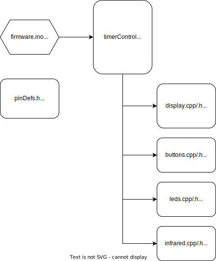

# ARC-Timer
Autonomous Robotics Competition (BYU) Match Timer Firmware

```clang-format``` recommended to keep formatting consistent.

Follow the project file structure laid out at: http://www.gammon.com.au/forum/?id=12625

```firmware.ino``` is the main project file.

Pin definitions can be set in ```pinDefs.h```.

**Firmware Organization:**


